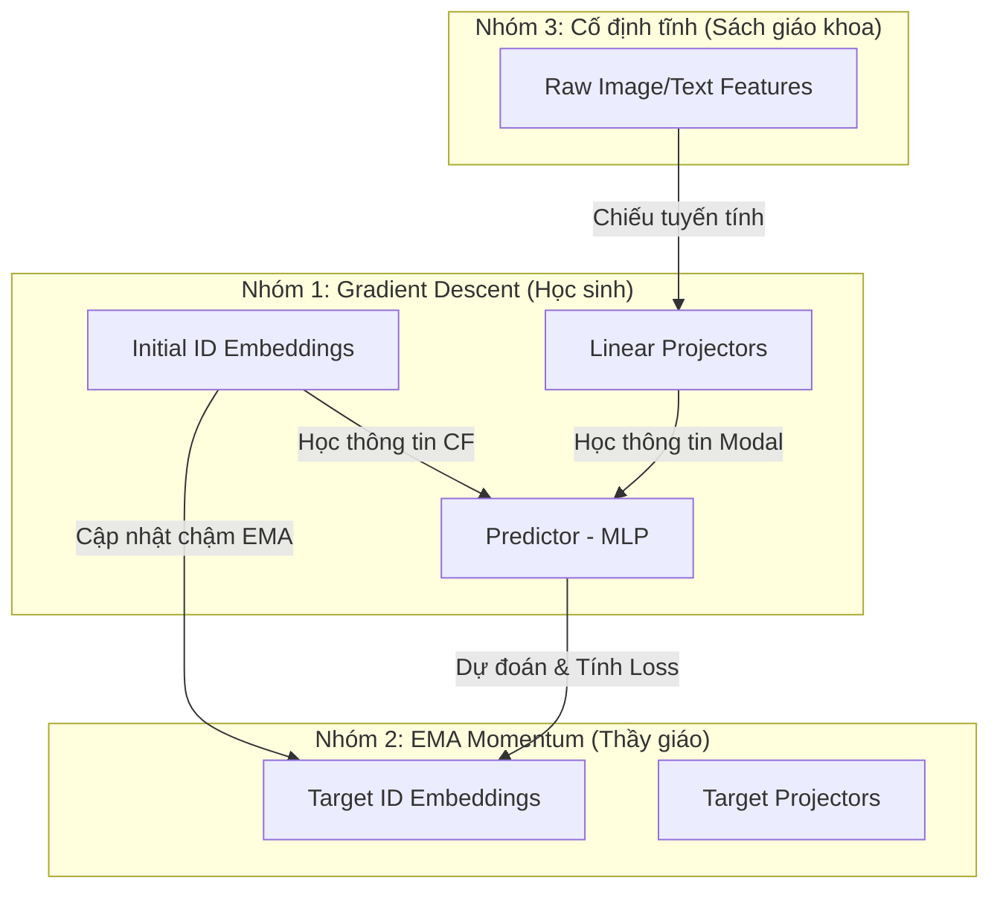

# CẨM NANG HỎI ĐÁP (QA) TOÀN DIỆN VỀ CÁC MÔ HÌNH FASHION RECOMMENDATION
## (LightGCN, CombiGCN, BM3, FREEDOM)

Tài liệu này tổng hợp chi tiết toàn bộ các câu hỏi, khái niệm nền tảng, cơ chế hoạt động, luồng dữ liệu và so sánh chuyên sâu giữa ba mô hình gợi ý thời trang đa phương thức: **CombiGCN**, **BM3** và **FREEDOM** (dựa trên nền tảng **LightGCN**).

---

## MỤC LỤC
1. [Tổng Quan & Phân Loại Mô Hình (Model Classification & Overview)](#1-tổng-quan--phân-loại-mô-hình)
2. [Chi Tiết Kiến Trúc & Luồng Dữ Liệu Từng Mô Hình (Architecture & Data Flow)](#2-chi-tiết-kiến-trúc--luồng-dữ-liệu-từng-mô-hình)
    - [Mô hình CombiGCN](#a-mô-hình-combigcn)
    - [Mô hình BM3](#b-mô-hình-bm3)
    - [Mô hình FREEDOM](#c-mô-hình-freedom)
3. [Xử Lý Thuộc Tính Đa Phương Thức (Multimodal Feature Processing)](#3-xử-lý-thuộc-tính-đa-phương-thức)
4. [Phân Loại File Dữ Liệu Đầu Vào (Input Data Files Classification)](#4-phân-loại-file-dữ-liệu-đầu-vào)
5. [So Sánh Nhánh Thuộc Tính & Đồ Thị Tương Đồng (Multimodal & Similarity Graph Comparison)](#5-so-sánh-nhánh-thuộc-tính--đồ-thị-tương-đồng)

---

## 1. TỔNG QUAN & PHÂN LOẠI MÔ HÌNH

### Khái niệm nền: Fusion Level trong Multimodal RecSys
Khi tích hợp nhiều nguồn thông tin (tín hiệu Collaborative Filtering + Hình ảnh + Văn bản) vào hệ thống gợi ý, việc quyết định **tích hợp chúng ở đâu trong pipeline** (Fusion Level) là cực kỳ quan trọng:

*   **🔵 CombiGCN $\to$ *Data-level fusion* ("Hợp nhất trước khi học"):**
    *   Xây dựng 2 đồ thị riêng biệt: đồ thị tương tác user-item (CF) và đồ thị tương đồng item-item (từ ảnh/text).
    *   Kết hợp hai đồ thị này ngay ở tầng cấu trúc dữ liệu đầu vào.
    *   Truyền thông điệp (message passing) đồng thời trên cả hai đồ thị trong cùng một lần forward pass trước khi học embedding.
*   **🟡 BM3 $\to$ *Model-level fusion* ("Học chung, căn chỉnh qua loss"):**
    *   Mỗi modality (CF, ảnh, text) có các bộ mã hóa (encoder/projector) riêng biệt nhưng tất cả đều được chiếu chung vào một không gian embedding kích thước $512$-chiều.
    *   Dùng hàm loss đối lập tự giám sát (Bootstrap Contrastive Loss) để tự động kéo các view (góc nhìn) khác nhau của cùng một item lại gần nhau trong không gian chung.
*   **🔴 FREEDOM $\to$ *Model-level fusion, decoupled* ("Học độc lập, liên kết bằng loss"):**
    *   Duy trì 2 nhánh hoàn toàn tách biệt: nhánh CF (LightGCN trên đồ thị tương tác) và nhánh Semantic (kNN graph thuần từ đặc trưng ảnh/text).
    *   Không chia sẻ tham số giữa hai nhánh; thay vào đó, dùng hàm loss InfoNCE để tạo lực kéo giữa biểu diễn của hai nhánh.

### Tóm tắt so sánh sơ bộ

| Tiêu chí | CombiGCN | BM3 | FREEDOM |
| :--- | :--- | :--- | :--- |
| **Thời điểm Fusion** | Trước khi học (tầng cấu trúc đồ thị) | Trong lúc học (tầng embedding) | Trong lúc học (tầng loss) |
| **Chia sẻ không gian** | Có (1 đồ thị tích hợp chung) | Có (cùng chiếu về 1 không gian) | Không (2 nhánh hoạt động độc lập) |
| **Loss đặc trưng** | BPR Loss thông thường | Bootstrap Contrastive Loss | InfoNCE Loss |

### Tại sao cả 3 mô hình đều chọn LightGCN làm nền tảng?
1.  **Mô hình nền tảng CF chuẩn mực:** Trong hệ thống gợi ý dạng đồ thị, LightGCN hiện là mô hình SOTA về mặt học hành vi tương tác lịch sử. Khác với các GNN cũ (như NGCF) lạm dụng các ma trận trọng số và hàm kích hoạt phi tuyến (ReLU) phức tạp gây Overfitting và chậm, LightGCN loại bỏ chúng để chạy cực nhẹ và hiệu quả.
2.  **Sự phân hóa nằm ở nhánh Modal (Ảnh/Chữ):** Nhận thấy luồng CF của LightGCN đã quá tối ưu, các tác giả giữ nguyên luồng này để đảm bảo tính ổn định của việc học hành vi, và chỉ tập trung cải tiến nhánh Đa phương thức (Modal Branch) để tìm ra cách dung hợp đặc trưng tối ưu nhất.

---

## 2. CHI TIẾT KIẾN TRÚC & LUỒNG DỮ LIỆU TỪNG MÔ HÌNH

### A. MÔ HÌNH COMBIGCN

Sơ đồ CombiGCN gồm 3 giai đoạn chính chạy từ dưới lên trên:

#### Giai đoạn 1: Chuẩn bị nguyên liệu (Offline & Khởi tạo ban đầu)
*   **Block "Precomputed Data & Similarity" (Offline):** Hệ thống lấy đặc trưng thô (ảnh/text) tính toán sẵn ma trận tương đồng $W$ (Similarity Matrix) tĩnh. Bước này không chứa các lớp học và ma trận $W$ bị đóng băng trong suốt quá trình train.
*   **Block "Initial Embeddings":** Khởi tạo ngẫu nhiên các vector ID ban đầu cho người dùng (`User ID Emb`) và sản phẩm (`Item ID Emb`). Đây là các tham số sẽ liên tục tiến hóa qua Gradient Descent.

#### Giai đoạn 2: Lõi xử lý - Các lớp CombiGCN (Stack of N Layers)
Ở mỗi Layer, hai nhánh sau chạy song song:
1.  **Nhánh CF (User-Item Branch):** Thực hiện tích chập đồ thị (`Graph Conv`) trên ma trận tương tác để User và Item trao đổi hành vi.
2.  **Nhánh Sim (Item-Item Branch):** Lấy vector của Item hiện tại nhân với ma trận tương đồng tĩnh $S$ ($S \times \text{Item Emb}$).
3.  **Dung hợp (Item Fusion ⊕):** Cộng trực tiếp biểu diễn từ hai nhánh lại với nhau để làm đầu ra của lớp đó và làm đầu vào cho lớp kế tiếp.

#### Giai đoạn 3: Tổng hợp và Đánh giá
*   **Mean Aggregation (Trung bình cộng):** Cộng trung bình tất cả đầu ra từ các lớp (từ lớp 0 đến lớp N) để có embedding cuối cùng: `Final User Emb` và `Final Item Emb`.
*   **BPR Loss:** Tính toán điểm dự đoán và so sánh với nhãn thực tế để lấy sai số, lan truyền ngược điều chỉnh `Initial Embeddings` ở Giai đoạn 1.

---

#### 💡 Câu Hỏi Chuyên Sâu về CombiGCN

##### Q1: Đã có ma trận tương tác rồi, tại sao vẫn cần khởi tạo User/Item Embedding ngẫu nhiên?
*   **Ma trận tương tác (`interaction_adj`):** Chỉ là một **"sơ đồ đường đi"** tĩnh (chỉ chứa liên kết $0$ và $1$ biểu diễn hành vi). Nó không chứa thông tin về gu của người dùng hay đặc trưng thuộc tính của sản phẩm.
*   **User/Item Embeddings:** Là các vector số thực đa chiều (ví dụ $512$ chiều) đóng vai trò làm **"tọa độ xuất phát"** trong không gian đặc trưng. Phép toán dự đoán yêu cầu tính tích vô hướng giữa hai vector này. Việc khởi tạo ngẫu nhiên cung cấp tham số có thể tối ưu hóa cho máy tính điều chỉnh tọa độ (xoay/dịch chuyển) thông qua Lan truyền ngược.

##### Q2: Tại sao trong code lại ghép dọc thành `ego` rồi nhân ma trận kề thay vì nhân riêng lẻ?
Đoạn code trong hàm `get_embedding` của CombiGCN ghép dọc User và Item thành một vector lớn:
```python
ego_emb = torch.cat([user_emb, item_emb], dim=0) # Kích thước: [N_users + N_items, 512]
interaction_emb = matmul(interaction_adj, ego_emb)
```
*   **Về mặt toán học:** Ma trận kề chuẩn hóa `interaction_adj` ($A$) có cấu trúc dạng khối:
    $$A = \begin{pmatrix} \mathbf{0} & R \\ R^T & \mathbf{0} \end{pmatrix}$$
    Khi thực hiện phép nhân $A \times \begin{pmatrix} \mathbf{h}_u \\ \mathbf{h}_i \end{pmatrix}$:
    *   Hàng tương ứng với User tự động bằng $R \times \mathbf{h}_i$ (nhận thông tin từ Item tương tác).
    *   Hàng tương ứng với Item tự động bằng $R^T \times \mathbf{h}_u$ (nhận thông tin từ User tương tác).
*   **Về mặt hiệu năng (Tối ưu GPU):** Phép ghép gộp này giúp GPU thực hiện tính toán song song toàn bộ đồ thị chỉ qua **một phép nhân duy nhất**, tăng tốc độ huấn luyện lên nhiều lần.

##### Q3: Dòng code `all_layers = [ego]` trong CombiGCN/LightGCN nghĩa là gì?
*   **Ý nghĩa:** Dùng để lưu lại đặc trưng tại mọi lớp lan truyền (từ Layer 0 đến Layer L). Đầu ra cuối cùng sẽ là trung bình cộng của tất cả các lớp này.
*   **Tác dụng:** Giúp tích hợp thông tin đa tầng (hàng xóm gần ở các lớp đầu, hàng xóm xa ở các lớp sau) đồng thời giữ lại "bản sắc gốc" (Layer 0 - Ego Embedding) để ngăn hiện tượng **Over-smoothing** (các node bị mượt hóa quá mức dẫn đến mất đi tính phân biệt khi đi qua nhiều lớp GCN).

##### Q4: Ma trận `interaction_adj` được tính toán và chuẩn hóa như thế nào?
1.  **Khởi dựng đồ thị lưỡng phân:** Ghép ma trận tương tác thô $R$ $[N_u \times N_i]$ và chuyển vị của nó $R^T$ để tạo ma trận kề $A$ có kích thước $[(N_u+N_i) \times (N_u+N_i)]$:
    $$A = \begin{pmatrix} \mathbf{0} & R \\ R^T & \mathbf{0} \end{pmatrix}$$
2.  **Chuẩn hóa đối xứng:** Để tránh việc các nút có bậc kết nối (degree) lớn làm bùng nổ trị số biểu diễn, ma trận được chuẩn hóa theo công thức:
    $$\tilde{A} = D^{-1/2} A D^{-1/2}$$
    Trong đó $D$ là ma trận bậc (Degree Matrix) chéo chứa số lượng tương tác của từng User/Item.

---

### B. MÔ HÌNH BM3

Mô hình BM3 dựa trên cơ chế **Tự giám sát bất đối xứng (Self-supervised Bootstrap)** tương tự BYOL để học đa phương thức mà không cần đến mẫu âm (negative samples).

#### Phân loại 3 nhóm tham số cập nhật trong BM3
BM3 chia các thành phần hệ thống thành 3 nhóm dựa trên cơ chế cập nhật:



1.  **Nhóm 1: Cập nhật trực tiếp bằng Gradient Descent (Học sinh chủ động học)**
    *   **ID Embeddings gốc ($\mathbf{h}_i^0, \mathbf{h}_u^0$):** Bộ nhớ cơ bản để học hành vi tương tác.
    *   **Linear Projectors:** Lớp tuyến tính ánh xạ đặc trưng thô về không gian $512$ chiều.
    *   **Predictor (MLP):** Bộ dự đoán phi tuyến, học cách phán đoán đặc trưng của nhánh đối diện.
2.  **Nhóm 2: Cập nhật bằng Động lượng EMA (Người thầy điềm tĩnh)**
    *   **Target Embeddings ($\mathbf{h}_{i,\text{target}}^0$):** Bản sao của ID Embeddings nhưng bị đóng băng (không nhận Gradient). Nó được cập nhật từ từ theo công thức Động lượng (EMA):
        $$\mathbf{h}_{i,\text{target}}^0 \leftarrow \tau \cdot \mathbf{h}_{i,\text{target}}^0 + (1 - \tau) \cdot \mathbf{h}_i^0 \quad (\text{với } \tau = 0.995)$$
    *   Giúp giữ mục tiêu (target) cực kỳ ổn định, làm mỏ neo giúp mô hình không bị sụp đổ biểu diễn.
3.  **Nhóm 3: Cố định hoàn toàn (Sách giáo khoa tĩnh)**
    *   **Raw Features (`image_feats`, `text_feats`):** Các vector đặc trưng được trích xuất sẵn offline (từ BERT/MobileNetV2). Việc đóng băng chúng giúp tránh lỗi tràn bộ nhớ GPU (OOM) và tăng tốc độ train.

---

#### 💡 Câu Hỏi Chuyên Sâu về BM3

##### Q1: Predictor (khối màu xanh lá ở giữa) là gì? Công thức toán học ra sao?
*   **Định nghĩa:** Predictor thực chất là một mạng MLP (Multi-Layer Perceptron) 2 lớp tuyến tính xen kẽ hàm kích hoạt phi tuyến ReLU:
    ```python
    self.predictor = nn.Sequential(
        nn.Linear(embedding_dim, embedding_dim),
        nn.ReLU(),
        nn.Linear(embedding_dim, embedding_dim),
    )
    ```
*   **Công thức toán học:**
    $$q(\mathbf{x}) = \text{ReLU}(\mathbf{x} \mathbf{W}_1 + \mathbf{b}_1) \mathbf{W}_2 + \mathbf{b}_2$$
    Với $\mathbf{W}_1, \mathbf{W}_2 \in \mathbb{R}^{512 \times 512}$ và $\mathbf{b}_1, \mathbf{b}_2 \in \mathbb{R}^{512}$ là các tham số học thông qua Gradient Descent.

##### Q2: Tại sao không so khớp trực tiếp hai nhánh mà phải đi qua Predictor?
*   **Representation Collapse (Sụp đổ biểu diễn):** Nếu so sánh trực tiếp, hai nhánh sẽ học cách chiếu tất cả sản phẩm thành một vector hằng số giống hệt nhau (ví dụ: $[1, 1, ..., 1]$). Lúc này Loss đạt cực tiểu nhưng mô hình bị "liệt", không còn khả năng phân biệt sản phẩm.
*   **Vai trò của Predictor:** Bắt nhánh Online phải dự đoán nhánh Target (đã bị ngắt gradient bằng `detach()`). Sự bất đối xứng (asymmetry) này ngăn chặn triệt để hiện tượng sụp đổ biểu diễn, ép mô hình phải tìm kiếm các đặc trưng phân biệt thực tế.

##### Q3: Luồng dự đoán trong BM3 là 1 chiều hay 2 chiều?
*   **Trả lời:** Là **mũi tên một chiều (bất đối xứng)** từ Online sang Target. Cụ thể có hai luồng song song:
    1.  CF Online $\to$ Predictor $\to$ Target Modal (Ngắt Gradient).
    2.  Modal Online $\to$ Predictor $\to$ Target CF (Ngắt Gradient).

##### Q4: Công thức Loss tổng thể của BM3 ra sao?
BM3 được huấn luyện đồng thời bởi 2 hàm Loss:
1.  **BPR Loss (Học hành vi tương tác):**
    $$\mathcal{L}_{\text{BPR}} = -\sum_{(u,i,j) \in D} \ln \sigma(\hat{y}_{ui} - \hat{y}_{uj})$$
    Trong đó điểm dự đoán $\hat{y}_{ui} = \mathbf{h}_u^{\text{cf}} \cdot (\mathbf{h}_i^{\text{cf}} + \mathbf{h}_i^{\text{modal}})$.
2.  **Bootstrap Loss (Học tự giám sát căn chỉnh đa phương thức):**
    $$\mathcal{L}_{\text{align}} = \mathcal{L}_{\text{bootstrap}}(\mathbf{h}_i^{\text{cf}}, \mathbf{h}_i^{\text{modal}}) + \mathcal{L}_{\text{bootstrap}}(\mathbf{h}_i^{\text{modal}}, \mathbf{h}_i^{\text{cf}})$$
    Với công thức thành phần:
    $$\mathcal{L}_{\text{bootstrap}}(z_{\text{online}}, z_{\text{target}}) = 2.0 - 2.0 \cdot \frac{q(z_{\text{online}})}{\|q(z_{\text{online}})\|_2} \cdot \frac{z_{\text{target}.detach()}}{\|z_{\text{target}.detach()}\|_2}$$

---

### C. MÔ HÌNH FREEDOM

FREEDOM sử dụng kiến trúc **Decoupled GNN** nhằm giải quyết vấn đề nhiễu (noise) lan truyền khi gộp chung đồ thị hành vi và thuộc tính.

*   **Semantic View (Nhánh thuộc tính):** Tại thời điểm $t=0$, mô hình lấy đặc trưng ảnh/text đã chiếu để tạo ra đồ thị tương đồng $k$-lân cận gần nhất ($k\text{NN}$ với $k=10$).
*   **Cơ chế Đóng băng (Frozen):** Đồ thị $k\text{NN}$ này được cố định hoàn toàn trong suốt quá trình train để ngăn việc nhiễu pixel từ ảnh/text thô phá hỏng cấu trúc biểu diễn.
*   **Lan truyền decoupled:** Đặc trưng đa phương thức (`modal_emb`) chỉ được tích chập GCN trên đồ thị $k\text{NN}$ này. Nhánh CF vẫn chạy trên đồ thị tương tác. Cuối cùng, hai biểu diễn được cộng lại ở tầng cuối (Late Fusion).

---

## 3. XỬ LÝ THUỘC TÍNH ĐA PHƯƠNG THỨC

Đặc trưng hình ảnh và văn bản thô được trích xuất từ trước (offline) bằng các mô hình pre-trained lớn, sau đó được đưa vào mạng GNN.

### A. Quy trình trích xuất đặc trưng thô (Offline)
1.  **Đặc trưng hình ảnh (`image_feats`):** Lấy ảnh chính diện (displayOrder = 0) đưa qua:
    *   **MobileNetV2 (768 chiều):** Trích xuất ra vector đặc trưng thô $1280$ chiều $\to$ chuẩn hóa L2 $\to$ dùng PCA giảm xuống $768$ chiều (để đồng kích thước với BERT) $\to$ lưu vào cột `feature3` của file `items_features.csv`.
    *   **CLIP (512 chiều):** Đưa qua nhánh Visual Encoder của CLIP để lấy trực tiếp vector ngữ nghĩa ảnh $512$ chiều.
2.  **Đặc trưng văn bản (`text_feats`):** Lấy từ mô tả/tags của sản phẩm đưa qua:
    *   **BERT (768 chiều):** Mô tả (`description`) đi qua BERT để trích xuất ra vector ngữ nghĩa dày đặc $768$ chiều $\to$ lưu vào cột `feature2` của file `items_features.csv`.
    *   **TF-IDF (Lexical):** Ghép tên sản phẩm và tags $\to$ tính toán tần suất từ khóa để tạo vector thưa.

### B. Chiếu tuyến tính & Dung hợp trong mô hình (Online)
Khi đưa vào BM3 hay FREEDOM, do đặc trưng thô lệch chiều (CLIP 512, BERT 768), mô hình sử dụng các lớp chiếu tuyến tính:
*   **Lớp `nn.Linear(768, 512)`:** Đóng vai trò là một **phép chiếu tuyến tính** (phép nhân ma trận $\mathbf{y} = \mathbf{x}\mathbf{W} + \mathbf{b}$ với ma trận trọng số $\mathbf{W}$ kích thước $[768 \times 512]$), giúp xoay và dịch chuyển hệ tọa độ đặc trưng thô về không gian nhúng $512$ chiều của GNN.

**Các cấu hình dung hợp (Fusion):**
*   `img_only`: Chỉ lấy nhánh ảnh sau chiếu (`proj_img`).
*   `text_only` / `tfidf`: Chỉ lấy nhánh chữ sau chiếu (`proj_txt`).
*   `multimodal` (Late Fusion): Lấy trung bình cộng của 2 nhánh: $\frac{\text{proj\_img} + \text{proj\_txt}}{2}$.
*   `mm_attention` (Attention Fusion): Ghép dọc (`concat`) rồi đưa qua một lớp tuyến tính để mô hình tự học trọng số dung hợp.

---

## 4. PHÂN LOẠI FILE DỮ LIỆU ĐẦU VÀO

Các mô hình sẽ thực hiện load các tập tin khác nhau từ thư mục dữ liệu tùy vào cơ chế hoạt động của chúng:

### A. Các file dùng chung (Mô hình nào cũng load)
1.  **`train.txt`:** Chứa lịch sử tương tác User-Item tập train (dùng để định hình cấu trúc đồ thị, tính số lượng node, lấy mẫu cặp tương tác tích cực/tiêu cực).
2.  **`test.txt`:** Tương tác tập test để đánh giá hiệu năng (Recall@K, NDCG@K).
3.  **`s_interaction_adj_mat.npz`:** Ma trận kề tương tác chuẩn hóa đối xứng dạng thưa.

### B. Các file nạp riêng theo mô hình

#### 1. CombiGCN
CombiGCN **không nạp vector đặc trưng thô (`.npy`)**. Nó chỉ nạp ma trận tương đồng tĩnh dạng đồ thị kề `.npz` dựa trên cấu hình `--sim_type`:
*   Chạy `--sim_type tfidf`: Load **`s_tfidf_item_similarity_adj_mat.npz`**
*   Chạy `--sim_type img_only`: Load **`s_img_similarity_adj_mat.npz`**
*   Chạy `--sim_type multimodal`:
    *   Với Late Fusion (mặc định): Load **`s_multimodal_late_fusion_similarity_adj_mat.npz`**
    *   Với Attention Fusion: Load **`s_multimodal_attention_similarity_adj_mat.npz`**
*   Chạy `--sim_type none` (LightGCN thuần): Không load thêm file nào ngoài các file chung.

#### 2. BM3 & FREEDOM
Cả hai mô hình này đều nạp trực tiếp các file vector thô dạng `.npy` để thực hiện chiếu tuyến tính trong quá trình huấn luyện:
*   **`image_embeddings.npy`** (Vector đặc trưng ảnh thô của Items).
*   **`text_embeddings.npy`** (Vector đặc trưng văn bản thô của Items).

*(Lưu ý: Nếu cấu hình chạy `--sim_type img_only` thì chỉ load `image_embeddings.npy`; nếu chọn `tfidf` thì chỉ load `text_embeddings.npy`; nếu chọn `multimodal` thì load cả 2 file).*

---

## 5. SO SÁNH NHÁNH THUỘC TÍNH & ĐỒ THỊ TƯƠNG ĐỒNG

Dưới đây là bảng so sánh chi tiết sự khác biệt cốt lõi ở nhánh Đa phương thức/Đồ thị tương đồng (Content/Similarity Branch) giữa ba mô hình:

### A. Bảng so sánh chi tiết

| Tiêu chí | CombiGCN | BM3 | FREEDOM |
| :--- | :--- | :--- | :--- |
| **Tên nhánh trên sơ đồ** | **Item-Item Sim Branch** *(vàng)* | **Modal Branch** *(đỏ nhạt)* | **Semantic View** *(xanh lá)* |
| **Đồ thị sử dụng** | Đồ thị tương đồng sản phẩm tĩnh $S$ (Cosine Similarity > 0.5 tính sẵn offline). | **Không dùng đồ thị**. Chỉ chiếu trực tiếp đặc trưng thô. | Đồ thị $k$NN (k=10) được dựng từ đặc trưng chiếu và **đóng băng (frozen)** từ $t=0$. |
| **Vector được lan truyền** | Vector ID Embedding đang được huấn luyện (`ego[Items]`). | Vector đặc trưng thô sau chiếu (`modal_emb`). **Không lan truyền qua đồ thị**. | Vector đặc trưng thô sau chiếu (`modal_emb`) lan truyền trên đồ thị $k$NN. |
| **Tham số học thêm** | **Không có**. Chỉ dùng ID Embeddings sẵn có, không có mạng con chiếu đặc trưng. | **Có**: Các lớp chiếu tuyến tính (Linear Projectors) và mạng Predictor để học tự giám sát. | **Có**: Các lớp chiếu tuyến tính (Linear Projectors) để đưa đặc trưng thô về 512-d. |
| **Cơ chế chập đồ thị** | Nhân ma trận tĩnh $S$ với ID embeddings ở mỗi layer GCN ($S \times \text{Item Emb}$). | Không có chập đồ thị. Chỉ căn chỉnh qua hàm loss tự giám sát bất đối xứng (Bootstrap CL). | Chập đồ thị trên nhánh Content riêng biệt bằng cách nhân $A_{kNN} \times \text{Modal Emb}$. |
| **Cách dung hợp (Fusion)** | **Layer-wise Fusion:** Cộng trực tiếp biểu diễn hai nhánh tại mỗi layer GCN. | **Late Fusion:** Cộng hai biểu diễn ở lớp cuối cùng (`item_cf` + `modal_emb`). | **Late Fusion:** Cộng biểu diễn của Interactive View và Semantic View ở lớp cuối cùng. |
| **Hiệu năng trên tập VCR thưa** | **Hội tụ nhanh** (280 epochs). Nhưng dễ bị **quá khớp** do không lọc được nhiễu ảnh/chữ thô. | **Hiệu năng tốt nhất**, kháng overfit cực tốt nhờ cơ chế bootstrap không mẫu âm. Train lâu hơn (720 epochs). | **Hiệu năng tệ nhất** (NDCG@10 giảm 53%) vì đồ thị kNN tĩnh bị đóng băng mang nhiều nhiễu pixel. |

---

### B. Bản chất lập trình (Mã giả minh họa luồng đi)

Để dễ hình dung sự khác biệt trong code huấn luyện, dưới đây là mã giả lược giản luồng lan truyền của từng mô hình:

#### 1. CombiGCN (Không tải đặc trưng thô vào mạng, truyền ID trên đồ thị tĩnh)
```python
# ego = concat([user_id_emb, item_id_emb])
# interaction_adj: đồ thị tương tác
# similarity_adj: đồ thị tương đồng tĩnh S

for layer in range(num_layers):
    # Nhánh 1: Tương tác User-Item
    cf_emb = matmul(interaction_adj, ego)
    
    # Nhánh 2: Tương đồng Item-Item
    item_id_emb = ego[N_users:]
    sim_emb = matmul(similarity_adj, item_id_emb)
    
    # Dung hợp & cập nhật cho layer sau
    ego_next_items = cf_emb[N_users:] + sim_emb
    ego = concat([cf_emb[:N_users], ego_next_items])
```

#### 2. BM3 (Không dùng đồ thị tương đồng, căn chỉnh qua Loss tự giám sát)
```python
# Nhánh CF (LightGCN thô trên đồ thị tương tác)
item_cf_emb = LightGCN(interaction_adj, item_id_embedding)

# Nhánh Modal (Chiếu tuyến tính đặc trưng thô, không qua đồ thị)
proj_img = Linear_Img(image_features)
proj_txt = Linear_Txt(text_features)
modal_emb = (proj_img + proj_txt) / 2

# Đầu ra cuối cùng dung hợp
item_final = item_cf_emb + modal_emb

# Tối ưu hóa bằng cách so khớp (Bootstrap Loss)
# CF_online -> Predictor -> Modal_target.detach()
# Modal_online -> Predictor -> CF_target.detach()
```

#### 3. FREEDOM (Đồ thị kNN tĩnh dựng từ tầng chiếu)
```python
# Nhánh 1: CF View (LightGCN trên đồ thị tương tác)
item_cf_emb = LightGCN(interaction_adj, item_id_embedding)

# Nhánh 2: Semantic View (GCN trên đồ thị kNN dựng sẵn và đóng băng)
proj_img = Linear_Img(image_features)
proj_txt = Linear_Txt(text_features)
modal_emb = (proj_img + proj_txt) / 2

# Lan truyền đặc trưng trên đồ thị kNN tĩnh
item_semantic_emb = GCN(frozen_kNN_graph, modal_emb)

# Dung hợp ở lớp cuối cùng
item_final = item_cf_emb + item_semantic_emb
```

---

## 6. CÂU HỎI HỘI ĐỒNG "HỎI XOÁY" Ở CHƯƠNG 4 (ĐÁNH GIÁ) & CÁCH CHỐT

> Phần này mô phỏng một **hội đồng phản biện khó tính** nhắm riêng vào Chương 4 (Evaluation). Mỗi mục gồm: **(Q)** câu hỏi hội đồng có thể hỏi, **(⚠️ Bẫy)** ý đồ thật sự phía sau câu hỏi, **(✅ Chốt)** hướng trả lời phòng thủ được — luôn theo nguyên tắc *thừa nhận trung thực giới hạn, không cãi liều, không hứa số liệu không có*.
>
> Số liệu tham chiếu: 24 configs = 3 model (BM3, CombiGCN, FREEDOM) × 2 encoder (CLIP, MBNv2) × 4 sim_type, trên VCR (553 user, 2.194 item, ~9.455 tương tác, ~3.8 item test/user). Best: `BM3·MBNv2·multimodal` NDCG@5=0.0162, NDCG@10=0.0186.

---

### 🔴 Nhóm A — Độ tin cậy thống kê (nguy hiểm nhất)

##### Q-A1: Mỗi config các em chỉ chạy **một lần (single run)**, không có seed lặp lại, không kiểm định ý nghĩa thống kê. Vậy chênh lệch BM3 0.0186 vs CombiGCN 0.0175 (chỉ +6% tại K=10) có thực sự khác biệt hay chỉ là **nhiễu ngẫu nhiên**?
*   **⚠️ Bẫy:** Đây là đòn chí mạng. Nếu chênh lệch nằm trong khoảng dao động do khởi tạo ngẫu nhiên/thứ tự batch, thì kết luận "BM3 tốt nhất" sụp đổ.
*   **✅ Chốt:**
    1.  **Thừa nhận thẳng** đây là một giới hạn (limitation) đã ghi rõ trong báo cáo: kết quả là *point estimate*, chưa có mean ± std qua nhiều seed nên chưa chạy kiểm định (t-test/Wilcoxon).
    2.  **Nhưng** kết luận chính không dựa vào riêng cặp 6% đó. Nó dựa vào **tính nhất quán đa chiều**: BM3 thắng mean score ở **5/6 metric** và thứ hạng `BM3 > CombiGCN > FREEDOM` **không đảo qua mọi K (1/5/10/20) và mọi metric**. Một kết quả nhiễu ngẫu nhiên rất khó giữ thứ hạng ổn định trên ~20 lát cắt độc lập.
    3.  Với các chênh lệch **lớn** (BM3 vs FREEDOM: gấp >2 lần, hay best vs worst gấp ~5.6 lần), khả năng do nhiễu là gần như bằng 0. Chỉ cặp BM3–CombiGCN tại K lớn là sát, nên báo cáo đã **hạ giọng** từ "vượt trội" xuống "gần tương đương ở K=10, chỉ tách bạch rõ ở K=5".
    4.  Hướng khắc phục tương lai: chạy 5 seed, báo cáo mean±std + paired test.

##### Q-A2: Các chỉ số của em **cực thấp, sát sàn** — NDCG@10 ~0.018, HR@10 ~0.07. Một hệ như vậy gần như **vô dụng thực tế**. Sao dám kết luận model nào "tốt"?
*   **⚠️ Bẫy:** Ngầm hỏi: nếu tất cả đều gần baseline ngẫu nhiên thì so sánh vô nghĩa.
*   **✅ Chốt:**
    1.  Con số tuyệt đối thấp là **đặc thù của bài toán top-K trên dataset thưa** (~3.8 item đúng/user ẩn trong 2.194 item ⇒ tỉ lệ ngẫu nhiên trúng ≈ 3.8/2.194 ≈ 0.0017). Best HR@10 ~0.07 tức **cao hơn ngẫu nhiên hàng chục lần** — model có học được tín hiệu thật, không phải đoán mò.
    2.  Mục tiêu của Chương 4 là **so sánh tương đối** giữa 24 lựa chọn thiết kế (encoder / fusion / kiến trúc), không phải tuyên bố sản phẩm production-ready. Trên cùng một thước đo, sự phân hóa ~5.6 lần giữa best và worst là tín hiệu so sánh hợp lệ.
    3.  Thừa nhận: giá trị tuyệt đối thấp phản ánh quy mô dữ liệu nhỏ và tính thưa; đây là limitation, không phải lỗi phương pháp.

##### Q-A3: Vì sao **không có baseline** kiểu Popularity, ItemKNN, hay **LightGCN thuần (CF-only, không multimodal)**? Không có mốc đó thì làm sao biết đặc trưng đa phương thức **thật sự đóng góp** chứ không phải chỉ CF đang làm việc?
*   **⚠️ Bẫy:** Đây là lỗ hổng thiết kế thực. Nếu không có nhánh CF-only, không thể tách phần đóng góp của modal.
*   **✅ Chốt:**
    1.  **Thừa nhận** thiếu baseline non-multimodal là giới hạn (đã đưa vào phần Limitations, và đã bỏ mọi câu tự nhận "đã đánh giá LightGCN" — LightGCN chỉ là **CF backbone dùng chung** cả 3 model kế thừa, **không được benchmark riêng**).
    2.  **Bằng chứng gián tiếp cho đóng góp của modal có sẵn trong chính dữ liệu**: với BM3 và CombiGCN, `multimodal` (dùng cả ảnh+text) **luôn vượt** `img_only`/`tfidf` (chỉ 1 nguồn) — ví dụ BM3 mbnv2: multimodal 0.0186 vs img_only 0.0150 vs tfidf 0.0149. Việc thêm nguồn đặc trưng thứ hai cải thiện rõ ⇒ modal có đóng góp.
    3.  Tuy nhiên **so với CF-thuần** thì đúng là chưa đo được delta tuyệt đối — nên báo cáo chỉ kết luận "fusion đa phương thức tốt hơn đơn phương thức", **không** tuyên bố "multimodal tốt hơn CF-only".

##### Q-A4: 1000 epoch — em dừng huấn luyện bằng gì? Nếu chọn checkpoint tốt nhất **theo tập test** thì đó là **rò rỉ dữ liệu (leakage)**, con số bị thổi phồng.
*   **⚠️ Bẫy:** Kiểm tra có validation set riêng hay đang tune/early-stop trên test.
*   **✅ Chốt:** Trả lời thẳng theo đúng pipeline thật: chia **per-user temporal 80/20** thành train/test; nêu rõ checkpoint được chọn thế nào. Nếu **không có validation tách riêng** và chọn epoch tốt nhất trên test → phải **thừa nhận đây là optimistic bias** áp dụng *đồng đều cho cả 24 config* (nên so sánh tương đối vẫn công bằng, chỉ con số tuyệt đối bị nâng). Cam kết bổ sung validation split ở vòng sau. *(Đừng chối — hội đồng sẽ đòi xem code.)*

---

### 🔴 Nhóm B — Mâu thuẫn nội tại (dễ bị bắt lỗi logic)

##### Q-B1: RQ1 kết luận **"MobileNetV2 tốt hơn CLIP"**, nhưng chính bảng của em cho thấy **CombiGCN·img_only: CLIP 0.0220 >> MBNv2 0.0119** (K=20). Em đang **chọn lọc số liệu (cherry-pick)** để hợp với kết luận?
*   **⚠️ Bẫy:** Bắt mâu thuẫn trực tiếp headline vs data. Rất hay bị hỏi.
*   **✅ Chốt:**
    1.  Kết luận đã được **hạ xuống dạng có điều kiện**: "MobileNetV2 tạo ra **best config cho cả 3 model**; CLIP chỉ vượt ở các cấu hình **không tối ưu**" — chứ **không** phải "CLIP luôn thua".
    2.  Trường hợp CombiGCN·img_only·CLIP đúng là ngoại lệ và **báo cáo có nêu thẳng** như một dị biệt: khi chỉ dùng ảnh, CombiGCN lại hợp CLIP hơn. Việc trưng ra ngoại lệ này chính là **bằng chứng không cherry-pick**.
    3.  Luận điểm phòng thủ được vì tiêu chí là "encoder nào cho *cấu hình tốt nhất*" — và cả 3 best-config đều là MBNv2. CLIP không tạo best config cho bất kỳ model nào.

##### Q-B2: Em giải thích MBNv2 thắng vì "nắm bắt **texture/họa tiết** tốt hơn CLIP". Đây là **suy diễn** hay có **bằng chứng**? Có phân tích qualitative nào không?
*   **⚠️ Bẫy:** Phân biệt speculation vs evidence. Hội đồng ghét giải thích "kể chuyện".
*   **✅ Chốt:** Thừa nhận đây là **giả thuyết diễn giải (hypothesis)**, không phải kết luận được chứng minh — báo cáo nên (và đã) diễn đạt bằng "một giải thích hợp lý là..." chứ không khẳng định. Bằng chứng gián tiếp: CLIP tối ưu cho *semantic alignment ảnh–text tổng quát*, còn recommend thời trang phụ thuộc chi tiết visual cục bộ (chất liệu, hoa văn) — phù hợp với việc MBNv2 (thuần visual, không bị kéo về không gian ngữ nghĩa text) thắng ở fusion tối ưu. Chưa có phân tích ảnh định tính ⇒ ghi vào future work.

##### Q-B3: RQ2 nói attention **làm hại** model mạnh (BM3 −46%) nhưng **giúp** model yếu (FREEDOM +8%). Đây có phải **giải thích post-hoc** để "cứu" một kết quả bất thường? Rất khó tin thêm tham số lại làm tệ đi.
*   **⚠️ Bẫy:** Nghi ngờ câu chuyện overfit là bịa sau khi thấy số.
*   **✅ Chốt:**
    1.  Cơ chế hợp lý *trước* khi nhìn số: `multimodal_attention` **thêm một lớp tuyến tính học trọng số fusion** ⇒ tăng tham số. Trên dataset **~9.4k tương tác** (rất nhỏ), thêm capacity dễ gây **overfit** — hiện tượng kinh điển, không bịa.
    2.  BM3/CombiGCN đã có cơ chế fusion nội tại hiệu quả (bootstrap CL / layer-wise) nên lớp attention thừa ⇒ hại. FREEDOM yếu sẵn nên attention bù được chút, nhưng **vẫn xếp bét** — nghĩa là attention không "cứu" được nó ⇒ câu chuyện nhất quán, không phải để tô hồng.
    3.  Đã **xóa** câu ở Background từng nói attention "cho độ chính xác cao nhất" vì mâu thuẫn với phát hiện này.

##### Q-B4: Em chọn **K=5 làm metric chủ đạo vì nó "phân biệt model rõ nhất"**. Nhưng chọn đúng cái K làm kết luận của em trông đẹp nhất chẳng phải cũng là một dạng **cherry-pick ngưỡng đánh giá**?
*   **⚠️ Bẫy:** Rất sắc. Tại K=1 CombiGCN thắng, K=10 hai model ~ngang, chỉ K=5 BM3 vượt rõ ⇒ headline phụ thuộc lựa chọn K.
*   **✅ Chốt:**
    1.  Lý do chọn K=5 là **có cơ sở dữ liệu học (data-driven), không phải chọn cho đẹp**: mỗi user chỉ ~3.8 item đúng trong test ⇒ K=5 ≈ 1.3× ground-truth, là ngưỡng **tự nhiên** để đo top-K; K=10/20 gây **bão hòa recall** (đưa quá nhiều slot so với số đáp án đúng) làm các model "trông giống nhau"; K=1 quá khắt khe, biến động cao.
    2.  **Quan trọng:** báo cáo **không giấu** các K khác — trưng cả K=1 (CombiGCN thắng), K=10 (chênh co lại còn +6%), K=20. Việc **best-config chọn ra giống nhau ở K=5 và K=10** cho cả 3 model ⇒ *lựa chọn cấu hình ổn định*, chỉ *độ chênh* thay đổi.
    3.  Giữ K=10 song song đúng convention paper gốc BM3/FREEDOM/CombiGCN để so sánh literature ⇒ không lẩn tránh.

##### Q-B5: Vậy rốt cuộc **"BM3 tốt nhất" chỉ đúng khi K≥5**. Ở K=1 CombiGCN thắng. Kết luận model tốt nhất của em có phụ thuộc vào một lựa chọn tùy ý không?
*   **✅ Chốt:** Thừa nhận rõ ràng và **biến nó thành sắc thái, không phải điểm yếu**: kết luận đầy đủ là *"BM3 là lựa chọn tốt nhất cho gợi ý top-K (K≥5), CombiGCN là lựa chọn thay thế nếu use-case chỉ cần top-1 chính xác tuyệt đối"*. Đây là **khuyến nghị theo ngữ cảnh sử dụng**, phổ biến trong RecSys thực tế, chứ không phải kết luận mâu thuẫn.

---

### 🟠 Nhóm C — Tính công bằng của so sánh (fair comparison)

##### Q-C1: Cả 3 model chạy **cùng embed_size=512, cùng lr=0.001, cùng 1000 epoch**. Mỗi kiến trúc có siêu tham số tối ưu khác nhau. Em **có tune riêng từng model** không? Nếu không, so sánh **bất công** — có thể FREEDOM thua chỉ vì chưa được tune.
*   **⚠️ Bẫy:** Đòn nhắm vào tính công bằng. Nếu không tune per-model, FREEDOM "thua oan".
*   **✅ Chốt:**
    1.  Thừa nhận dùng **siêu tham số chung** để đảm bảo *so sánh có kiểm soát (controlled)* — cùng ngân sách, cùng backbone CF (LightGCN), cùng d=512 ⇒ khác biệt đến từ **thiết kế kiến trúc/fusion**, không phải từ việc ai được tune kỹ hơn. Đây là một *lựa chọn thiết kế thí nghiệm hợp lệ*, đánh đổi giữa công bằng-so-sánh và tối-ưu-tuyệt-đối.
    2.  Nhưng **thừa nhận thẳng**: kết quả FREEDOM có thể *dưới tiềm năng* của nó vì chưa grid-search riêng ⇒ báo cáo **không** kết luận "kiến trúc FREEDOM kém về bản chất", mà chỉ "FREEDOM **trong cấu hình dùng chung này, trên dataset này** cho kết quả thấp nhất".
    3.  Future work: per-model hyperparameter search.

##### Q-C2: FREEDOM trong **paper gốc là SOTA**, ở đây lại **bét bảng** (NDCG@10 thấp hơn BM3 53%). Là do **kiến trúc dở** hay do **em cài đặt/thích nghi sai**?
*   **⚠️ Bẫy:** Nghi ngờ lỗi implementation. Rất nặng ký nếu không trả lời được.
*   **✅ Chốt:**
    1.  Không phải lỗi cài đặt: FREEDOM chia sẻ **cùng CF backbone và cùng pipeline eval** với 2 model kia; nếu code sai nền tảng thì cả 3 đều hỏng.
    2.  Nguyên nhân hợp lý: FREEDOM dựa nặng vào **đồ thị kNN item-item đóng băng dựng từ feature thô**. Trên VCR nhỏ và ảnh/text nhiễu, đồ thị tĩnh này **khuếch đại nhiễu** thay vì lọc — đúng bản chất decoupled frozen graph. Paper gốc chạy trên dataset lớn (Amazon/…) với đặc trưng sạch hơn nhiều ⇒ **khác domain, khác quy mô**, SOTA không tự động chuyển giao.
    3.  Bằng chứng nội tại: attention *giúp* FREEDOM (+8%) trong khi *hại* các model khác ⇒ nhất quán với việc nhánh modal của FREEDOM đang thiếu tín hiệu tốt, cần thêm cơ chế học trọng số.

##### Q-C3: CombiGCN em ghi là **"adapted" (đã thích nghi)**. Em đã **sửa gì**? Sau khi sửa thì nó còn là CombiGCN gốc để so sánh công bằng không?
*   **✅ Chốt:** Nêu chính xác phần đã đổi (ví dụ: nguồn ma trận tương đồng — chuyển sang dùng đồ thị similarity đa phương thức `s_multimodal_*_similarity_adj_mat.npz` để thống nhất 4 sim_type với 2 model kia; giữ nguyên cơ chế lõi layer-wise fusion $S \times \text{ItemEmb}$). Nhấn mạnh việc adapt là **để đưa cả 3 model về cùng một không gian sim_type/encoder cho so sánh nhất quán**, và ghi rõ trong báo cáo ⇒ minh bạch, không phải sửa lén.

##### Q-C4: d=512 cho chỉ **2.194 item** — số chiều nhúng gần bằng 1/4 số item. Đây là **over-parameterization** nghiêm trọng, gần như mời gọi overfit. Sao không dùng d nhỏ hơn?
*   **✅ Chốt:** Thừa nhận d=512 là **over-parameterized** cho quy mô này (đã ghi vào Limitations). Lý do giữ 512: để **đồng nhất với chiều đặc trưng đa phương thức** (BERT 768→512, CLIP 512) và với cấu hình mặc định của các paper gốc, đảm bảo so sánh nhất quán. Đây cũng là một *nguồn overfit chung cho cả 24 config* nên không làm lệch so sánh tương đối. Future work: quét d ∈ {64,128,256}.

---

### 🟠 Nhóm D — Lựa chọn dữ liệu & metric

##### Q-D1: Em lọc **N-core 5** (bỏ user/item <5 tương tác). Nhưng cold-start chính là **kịch bản mà multimodal đáng lẽ tỏa sáng nhất**. Lọc bỏ nó đi có phải em đang **tự tay triệt tiêu lợi thế của modal** và **thổi phồng vai trò của CF**?
*   **⚠️ Bẫy:** Cực sắc, đánh vào chính động cơ nghiên cứu. Multimodal sinh ra để cứu cold-start, mà bạn lọc cold-start đi.
*   **✅ Chốt:**
    1.  Thừa nhận đây là một **đánh đổi thật**: N-core 5 loại bỏ đuôi thưa để đồ thị đủ đặc cho GNN học ổn định (và để có đủ item test/user), nhưng đúng là **làm nhẹ đi kịch bản cold-start**.
    2.  Hệ quả đúng hướng khiêm tốn: nếu bỏ lọc, khả năng cao **khoảng cách multimodal vs CF-only còn rộng hơn** ⇒ kết quả hiện tại là *ước lượng thận trọng (conservative)* cho lợi ích của modal, không phải thổi phồng.
    3.  Ghi vào future work: đánh giá riêng trên **nhóm cold-start** (user/item ít tương tác) để đo đúng đóng góp của đặc trưng nội dung.

##### Q-D2: Vì sao chọn **NDCG làm metric chủ đạo** mà không phải Recall? Với chỉ ~3.8 item đúng/user, thứ tự xếp hạng (thứ NDCG thưởng) có thật sự **có ý nghĩa** không?
*   **✅ Chốt:** NDCG được chọn vì nó **phân tách 24 config rõ nhất** (biên độ rộng nhất trong các metric) và **thưởng đúng thứ hạng** — quan trọng với gợi ý top-K nơi vị trí item đúng ảnh hưởng trải nghiệm. Với ~3.8 item đúng, thứ hạng vẫn có nghĩa ở K=5 (đẩy item đúng lên đầu 5 slot). **Không phụ thuộc một metric**: báo cáo trưng cả 6 metric và BM3 thắng mean ở 5/6 ⇒ kết luận không do chọn NDCG.

##### Q-D3: Em báo cáo **6 metric × 4 K = 24 con số/config**. So sánh trên nhiều thước đo như vậy dễ dính **multiple comparisons** — vài "chiến thắng" chỉ là **may rủi thống kê**. Em kiểm soát điều đó thế nào?
*   **✅ Chốt:** Chính vì nguy cơ đó, kết luận **không** rút từ một ô số riêng lẻ mà từ **mẫu hình nhất quán**: cùng một config (`BM3·mbnv2·multimodal`) thắng ở 5/6 metric *và* thứ hạng tổng giữ nguyên qua mọi K. Multiple comparisons gây lo ngại khi ta *chọn cái thắng lẻ trong nhiễu*; ở đây tín hiệu là **đồng thuận trên gần như toàn bộ lát cắt**, ngược lại với cherry-pick. Thừa nhận: chưa hiệu chỉnh Bonferroni/FDR vì chưa có phân phối nhiều seed — đưa vào future work.

##### Q-D4: **Twist HIT_RATIO**: `combigcn·clip·multimodal` mới là quán quân Hit Ratio (0.0737), không phải BM3. Sao em **gạt nó đi** như "ngoại lệ duy nhất"? Biết đâu HR mới là metric đáng quan tâm với người dùng?
*   **✅ Chốt:** Không gạt — báo cáo **nêu thẳng** twist này. Diễn giải đúng: HR chỉ đo *"có ít nhất 1 item đúng lọt danh sách"*, **không** phạt vị trí; CombiGCN+CLIP nhạy ở việc **bắt được đáp án** nhưng **xếp hạng kém hơn BM3** (thua ở NDCG/MRR/MAP — các metric có tính vị trí). Với gợi ý top-K, chất lượng **thứ hạng** (NDCG) thường quan trọng hơn HR thô ⇒ BM3 vẫn là khuyến nghị. Nếu use-case chỉ cần "có đúng trong list" (vd hệ thống lọc thô tầng 1) thì CombiGCN+CLIP là lựa chọn hợp lý — lại là **khuyến nghị theo ngữ cảnh**.

---

### 🟡 Nhóm E — Giá trị & tổng quát hóa

##### Q-E1: Chênh lệch NDCG@10 giữa BM3 và CombiGCN chỉ **0.0011 tuyệt đối**. Con số đó có **ý nghĩa thực tế** gì với người dùng cuối không, hay chỉ có ý nghĩa trên bảng?
*   **✅ Chốt:** Thừa nhận **ý nghĩa thực tiễn (practical significance) khác với ý nghĩa thống kê**: ở K=10 chênh lệch nhỏ nên báo cáo đã kết luận hai model **"gần tương đương"** tại K=10, và **chỉ khẳng định BM3 vượt rõ ở K=5** (+18% tương đối — mức đáng kể). Không thổi phồng 0.0011 thành "vượt trội". Đây đúng tinh thần hạ giọng đã áp dụng toàn báo cáo.

##### Q-E2: Toàn bộ kết luận dựa trên **một dataset (VCR) rất nhỏ**. Khuyến nghị "BM3·MBNv2·multimodal" liệu có **tổng quát** sang dataset/domain khác? Ngoại suy có nguy hiểm không?
*   **✅ Chốt:** Thừa nhận **external validity hạn chế** — 1 dataset, 1 domain (thời trang cho thuê), quy mô nhỏ ⇒ khuyến nghị mang tính **theo ngữ cảnh dataset này**, không tuyên bố phổ quát. Điểm bền vững để tin: các *xu hướng* (fusion đa phương thức > đơn phương thức; visual chủ đạo hơn text; thêm attention gây overfit trên dữ liệu nhỏ) **nhất quán với hiểu biết chung trong literature RecSys đa phương thức**, nên có giá trị định hướng. Đã ghi rõ "cần kiểm chứng trên dataset lớn hơn / domain khác" trong Kết luận & Future work.

##### Q-E3 (câu tổng kết hay bị hỏi cuối cùng): Nếu chỉ được giữ **một câu** kết luận Chương 4 mà **chắc chắn đúng**, em nói gì?
*   **✅ Chốt:** *"Trên dataset VCR quy mô nhỏ, **cách kết hợp đặc trưng (fusion) và kiến trúc model quyết định chất lượng gợi ý gần một bậc độ lớn** (best/worst chênh ~5.6 lần); trong đó **hợp nhất đa phương thức bằng Late Fusion ổn định nhất**, còn **thêm attention gây overfit trên dữ liệu nhỏ** — với thứ hạng `BM3 > CombiGCN > FREEDOM` nhất quán qua mọi K và metric."* Đây là câu **không phụ thuộc số tuyệt đối** nên khó bị bắt bẻ.

---

### 📌 Ghi nhớ chiến thuật trả lời phản biện Chương 4
1.  **Không cãi số liệu — hạ giọng kết luận.** Mọi chênh lệch nhỏ (BM3–CombiGCN @K10, HR twist, CLIP thắng lẻ) đều đã được reframe thành "gần tương đương / theo ngữ cảnh", nên đừng khẳng định tuyệt đối.
2.  **Vũ khí mạnh nhất = tính nhất quán đa chiều** (5/6 metric, thứ hạng ổn định qua mọi K) — dùng nó để phản đòn câu "single run / nhiễu".
3.  **Chủ động thừa nhận limitation trước khi bị hỏi**: single-run/no-seed, thiếu baseline CF-only, no validation split, N-core lọc cold-start, d=512 over-parameterized, 1 dataset. Thừa nhận đúng chỗ khiến hội đồng tin phần còn lại.
4.  **Ranh giới không được vượt:** KHÔNG hứa/bịa số liệu chưa chạy; KHÔNG nói "đã đánh giá LightGCN" (không hề benchmark); KHÔNG khẳng định "MBNv2 luôn > CLIP" hay "attention luôn tệ".

---
*Tài liệu chi tiết hơn về mã nguồn đầy đủ của 3 mô hình được lưu trữ tại file: [pseudo_code_v2.md](file:///E:/DoCode/CD2/source/Source/get_hrs_rs/rs/Docs/data_toModel/pseudo_code_v2.md).*
