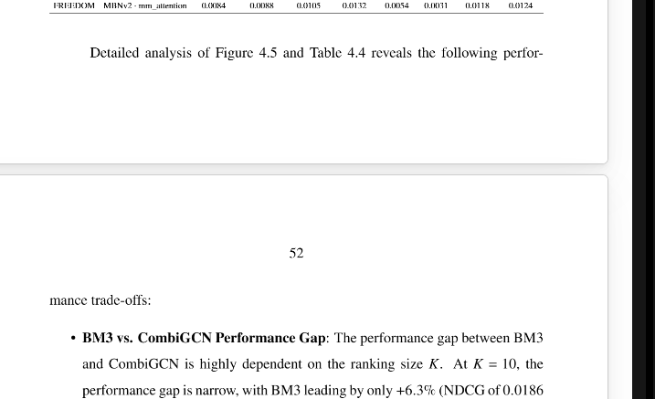
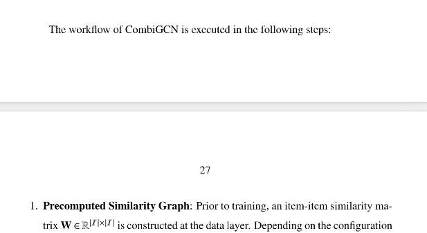

Chương 4
- chỗ 4.3.1.2 Comprehensive Multi-Metric Analysis (Radar Plot Analysis)
- Cái plot nó nhảy xuống dưới làm mất trống 1 khoảng

- Các gạch đầu dòng (là các hình chấm bi đen á) tách hơn lớn ![alt text(image.png)

- 
- trang 52 cũng bị lỗi 
nếu có 1 đoạn ngắn xuất hiện như vậy thì phải xuống trang khác á 
- Cần ctrl enter giống word

CHương 3
- trang 35 nó có 1 đoạn ngắn vậy thôi mà phải cần 1 trang nên mình muốn chỗ 3.3 này rút gọn 1 tí được không

-Chương 3 cũng có tình trạn vậy nè 

nếu có 1 đoạn ngắn xuất hiện như vậy thì phải xuống trang khác á 
- Cần ctrl enter giống word

