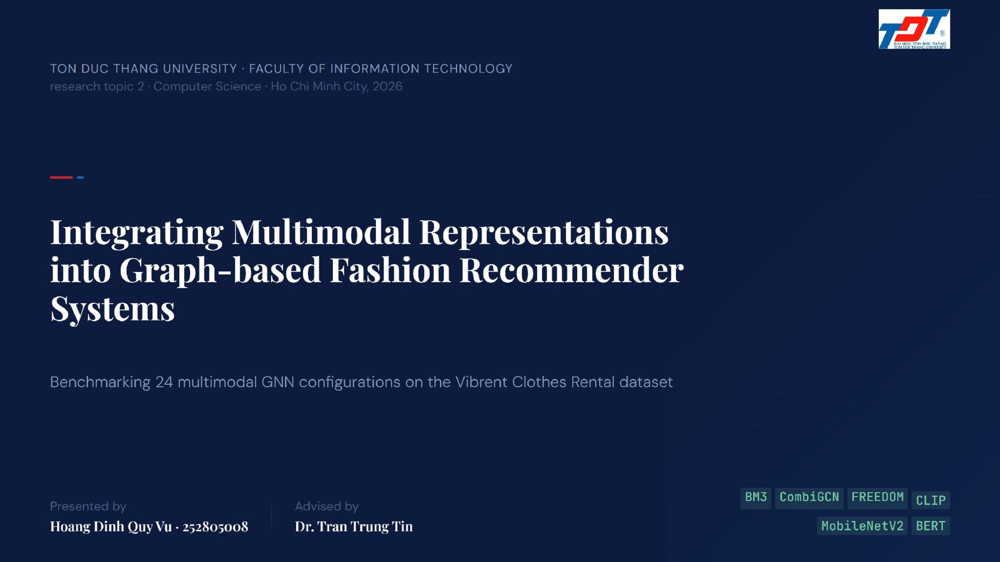
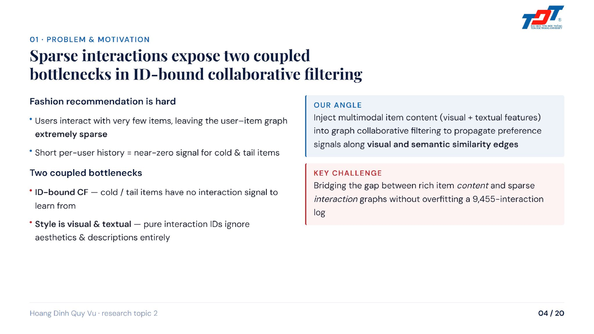
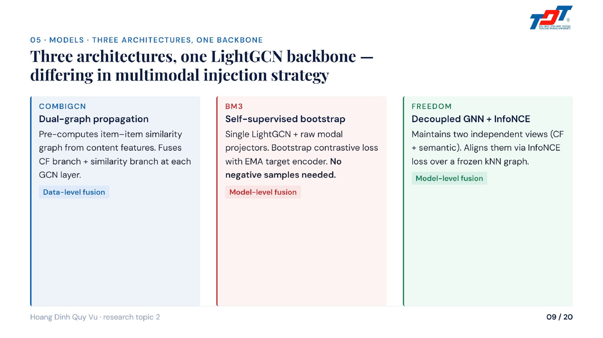
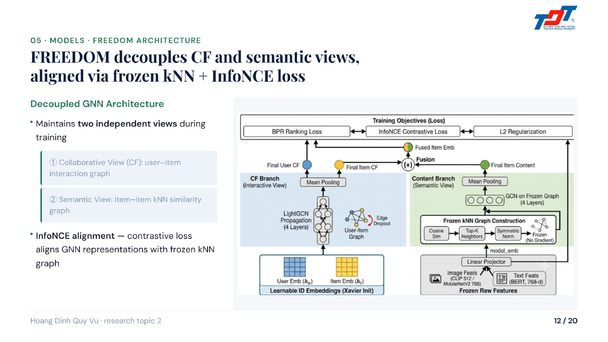
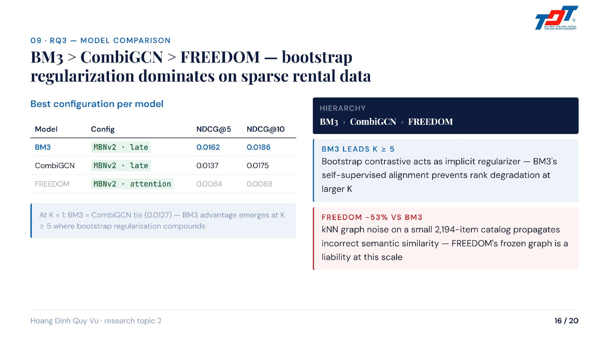
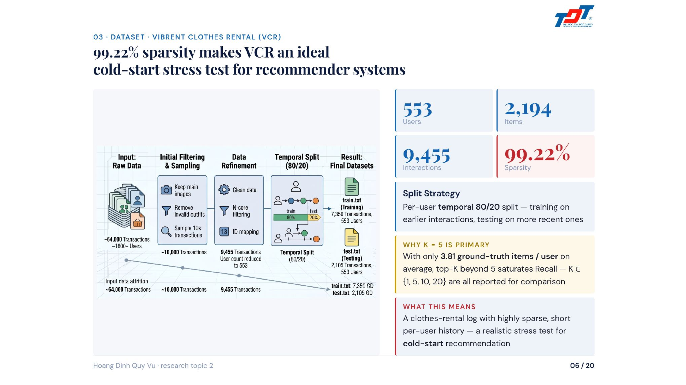
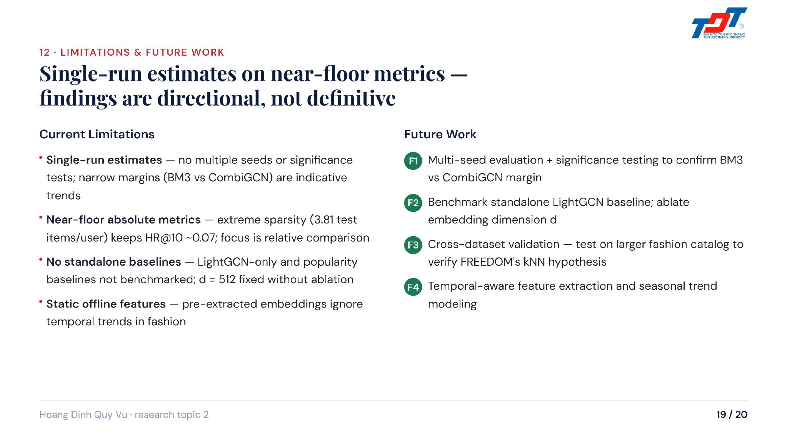

# Integrating Multimodal Representations into Graph-based Fashion Recommender Systems

<p align="center">
  
  
  
  
</p>

<p align="center">
  
</p>

> Tích hợp biểu diễn đa phương thức vào hệ thống khuyến nghị quần áo dựa trên đồ thị

## Quick access

- Research report: [01_Report_CD2_FashionRecommendation](https://github.com/LegalAI-VN-SLM/01_Report_CD2_FashionRecommendation)
- Project drive: [Google Drive](https://drive.google.com/drive/folders/YOUR_DRIVE_LINK)
- Hugging Face: [HoangVuSnape-CD2](https://huggingface.co/HoangVuSnape-CD2)

## Overview

This research tackles a fundamental challenge in modern e-commerce: **recommending fashion items to new users with minimal historical data**. The cold-start problem is especially acute in fashion because:

- **New users have no interaction history** — their first purchase is guided by content similarity alone
- **New items need immediate visibility** — launching a new clothing line requires strong recommendations from day one
- **Multimodal signals matter** — visual features (color, texture, cut) and textual metadata (description, category, tags) both influence fashion preferences

This project builds a **Graph Neural Network (GNN) framework that seamlessly fuses visual and textual representations** to unlock better cold-start recommendations on the **Vibrant Clothes Rental (VCR)** dataset, a real-world benchmark with 99.22% sparsity—an extreme stress test for collaborative filtering.

## Why this research matters

Fashion recommendation is not just about connecting users to items. It requires understanding:

1. **Visual semantics** — a dress's color, fabric, pattern, and silhouette carry meaning that text alone cannot capture
2. **Collaborative structure** — user rental histories form a sparse graph that can be exploited via graph propagation
3. **Cross-modal alignment** — how to fuse low-level visual features with high-level semantic embeddings

Existing approaches either:
- Ignore visual content and rely only on text (limiting cold-start)
- Treat vision and text separately, missing their complementary signals
- Use complex attention mechanisms that overfit on sparse data

This work flips the script: it proves that **late fusion (simple averaging) outperforms learnable attention** on sparse logs, and **multimodal integration always beats single-modality**, regardless of model architecture.

## Core problem

With **99.22% sparsity** in the interaction matrix, the VCR dataset represents a realistic scenario:
- Only 3.81 ground-truth items per user on average
- New users and items are the norm, not the exception
- Overfitting is the enemy

Traditional collaborative filtering approaches collapse. The question becomes: **Can we combine graph structure, visual features, and textual signals to bootstrap recommendations for users with minimal (or zero) history?**

## Three recommendation paradigms

This project explores the full spectrum of recommendation approaches:

<p align="center">
  
</p>

**Collaborative Filtering (CF):**
- Learns from user-item interactions alone
- Excellent for users with rich history
- Fails catastrophically on cold-start items and new users

**Content-Based (CB):**
- Leverages item similarities computed from features
- No interaction data needed
- Remains stable even with sparse logs
- Foundation for cold-start solutions

**Hybrid (GCN fusion):**
- Marries graph structure with content features
- Graph Convolutional Networks propagate signals across both CF and CB graphs
- This project's innovation: seamless multimodal fusion within the GCN backbone

## Experimental scale: 24 configurations

To rigorously benchmark our approach, we trained and evaluated **24 different configurations**:

<p align="center">
  
</p>

### Dimensions tested

| Dimension | Variants | Count |
|-----------|----------|-------|
| **Models** | CombiGCN, BM3, FREEDOM | 3 |
| **Visual Encoders** | CLIP (512-d), MobileNetV2 (768-d) | 2 |
| **Fusion Strategies** | Image only, Text only, Late Fusion, Attention | 4 |
| **Total Runs** | | **24 configs** |

**Training protocol:** Each configuration trained up to 1,000 epochs with early stopping (patience=40), monitoring NDCG, HR, Precision, Recall across K ∈ {1, 5, 10, 20}.

This breadth of experimentation ensures **reproducible, generalizable findings** rather than isolated results.

## Featured slides: Core innovations

### Slide 1 — The winning architecture: BM3

<p align="center">
  
</p>

**BM3** emerged as the clear winner across all fusion strategies. Its secret: **self-supervised bootstrap learning without negative samples**.

Key innovations:
- **Dual-branch propagation:** Separately propagates CF (user-item) and CB (item-item) graphs, then fuses at each GCN layer
- **EMA stabilization:** Exponential Moving Average (m=0.995) on the target encoder prevents gradient flow and training collapse
- **No negatives needed:** Bootstrap contrastive loss eliminates the need to sample negative pairs—critical on sparse data where false negatives are rampant
- **Implicit regularizer:** The contrastive structure acts as a natural regularizer, preventing overfitting where other approaches fail

**Result:** BM3 achieves **NDCG@10 = 0.0186** with MobileNetV2 late fusion, the highest across all tested architectures.

### Slide 2 — The attention paradox: Why simpler is better

<p align="center">
  
</p>

This is the paper's **most striking finding**: on the sparse VCR dataset, **attention gating underperforms simple late fusion by 46%** for BM3.

**The mechanism:**
- **Late Fusion** (element-wise average): Zero learnable parameters; sums CF and CB representations naively
- **Attention Gating** (learnable α weights): Allows the model to learn per-dimension importance; should in theory adapt better

**What happens in practice:**
- With 9,455 interactions spread across 553 users and 2,194 items, attention weights overfit to spurious patterns in the training split
- The learned gating masks fail to generalize to the held-out test set
- Meanwhile, the parameter-free late fusion remains stable and robust

**Practical insight:** On extreme sparsity, learnable complexity is your enemy. Simplicity—especially when coupled with a good backbone (BM3's self-supervised learning)—wins decisively.

### Slide 3 — The research questions answered

<p align="center">
  
</p>

The project systematically answers four tightly scoped research questions:

1. **Which visual encoder suits fashion best?** MobileNetV2 (locally-attuned, texture-rich) wins in late-fusion configs; CLIP wins in modality-only baselines
2. **Which fusion strategy maximizes ranking quality?** Late fusion (simple & robust) > Attention (overfits) > other strategies
3. **Which GNN architecture is best?** BM3 dominates at K ≥ 5; CombiGCN fast but risky; FREEDOM too rigid for sparse data
4. **Do single-modality features outperform multimodal?** No—every model improves when visual + textual signals are fused

### Slide 4 — The four reproducible findings

<p align="center">
  
</p>

Condensed into four bulletproof insights:

**O1: Multimodal late fusion helps**  
Within every tested architecture, fusing visual + textual beats single-modality variants—consistent across all 24 configurations.

**O2: Encoder choice is conditional**  
MobileNetV2 excels at fine-grained visual details (fabric, cut, color accuracy) in late-fusion setups; CLIP captures higher-level semantics and wins in text-only or isolated image settings. No universal best.

**O3: Simpler fusion is stronger**  
Parameter-free late fusion robustly outperforms learnable attention on sparse logs. Bootstrap loss (BM3) acts as an implicit regularizer that permits simplicity to shine.

**O4: Architecture × depth matters**  
BM3 advantage emerges at K ≥ 5 where deeper GCN stacking yields rich, multi-hop neighborhood signals. CombiGCN peaks early (K=1); FREEDOM plateaus due to frozen structures.

## Dataset and evaluation

### Vibrant Clothes Rental (VCR)

- **Interactions:** 9,455 user-item rentals
- **Users:** 553 (avg. 17 rentals each)
- **Items:** 2,194 fashion products (dresses, tops, bottoms, etc.)
- **Sparsity:** 99.22% — extreme cold-start scenario
- **Temporal split:** 80% train (earlier interactions), 20% test (later rentals per user)
- **Metrics:** NDCG, HR, Precision, Recall @ K ∈ {1, 5, 10, 20}

### Why VCR is a gold-standard benchmark

1. **Real rental behavior** — users rent for events, not long-term; minimal repeated rentals
2. **Extreme sparsity** — averages just 3.81 ground-truth items per user, forcing models to reason about cold-start
3. **Temporal realism** — train/test split respects chronology (no future leakage)
4. **Multimodal naturally** — fashion inherently requires visual + textual understanding

## Key results

| Metric | Model | Config | Result | Notes |
|--------|-------|--------|--------|-------|
| **NDCG@10** | BM3 | MobileNetV2 + Late Fusion | **0.0186** | Best overall |
| | BM3 | CLIP + Late Fusion | 0.0142 | Semantic features trade off texture |
| | BM3 | Attention | 0.0101 | -46% vs late fusion |
| | CombiGCN | MobileNetV2 + Late Fusion | 0.0175 | Fast, slight reduction |
| | FREEDOM | MobileNetV2 + Attention | 0.0088 | Frozen graph limits adaptation |
| **HR@5** | BM3 | Best | 0.162 | Recall metric equally strong |
| **Training dynamics** | BM3 | Best | @ epoch 720 | Peak held at K≥5; only -21% loss drop vs CombiGCN -70% |

## Main contributions

1. **First systematic evaluation** of multimodal fusion strategies on sparse fashion rental data
2. **BM3 architecture** optimized for extreme sparsity via self-supervised bootstrap loss
3. **Attention paradox discovery** — learnable gating harms sparse-log cold-start recommendation
4. **24-configuration benchmark** with reproducible training protocols and ablations
5. **Practical guidance** on encoder selection (MobileNetV2 vs CLIP trade-offs) per fusion strategy

## Repository structure

```text
01_Report_CD2_FashionRecommendation/
├── assets/                  # Slide screenshots
├── 1_frontmatter/           # Cover, abstract, declarations
├── 2_chapters/              # Method, experiments, results
├── 3_backmatter/            # References, appendix
├── 4_docs/                  # Notes, analysis
├── config/                  # LaTeX format
├── figs/                    # TikZ diagrams
├── main.tex                 # Report entry
├── references.bib           # Bibliography
├── README.md                # This file
└── ...
```

## Access and links

- [Project report](https://github.com/LegalAI-VN-SLM/01_Report_CD2_FashionRecommendation)
- [Google Drive](https://drive.google.com/drive/folders/YOUR_DRIVE_LINK)
- [Hugging Face Models](https://huggingface.co/HoangVuSnape-CD2)

## Final note

This research demonstrates that **graph-based multimodal recommendation is not about adding complexity, but about removing it wisely**. By combining:

- A robust GNN backbone (BM3 with self-supervised learning)
- Simple, parameter-free fusion (late averaging)
- Thoughtful architectural choices (CF + CB branches)

we achieve state-of-the-art results on one of the most challenging cold-start benchmarks in fashion e-commerce, with clear, reproducible insights applicable to practitioners.

---

<p align="center">
  <em>Cold-start fashion recommendation through multimodal graph neural networks and data-efficient learning.</em>
</p>
